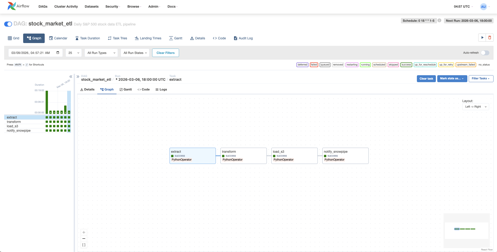
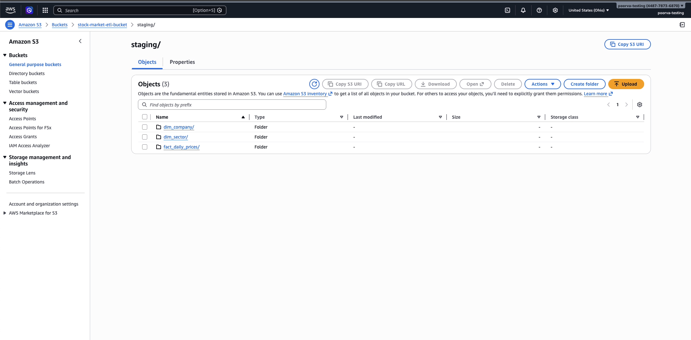
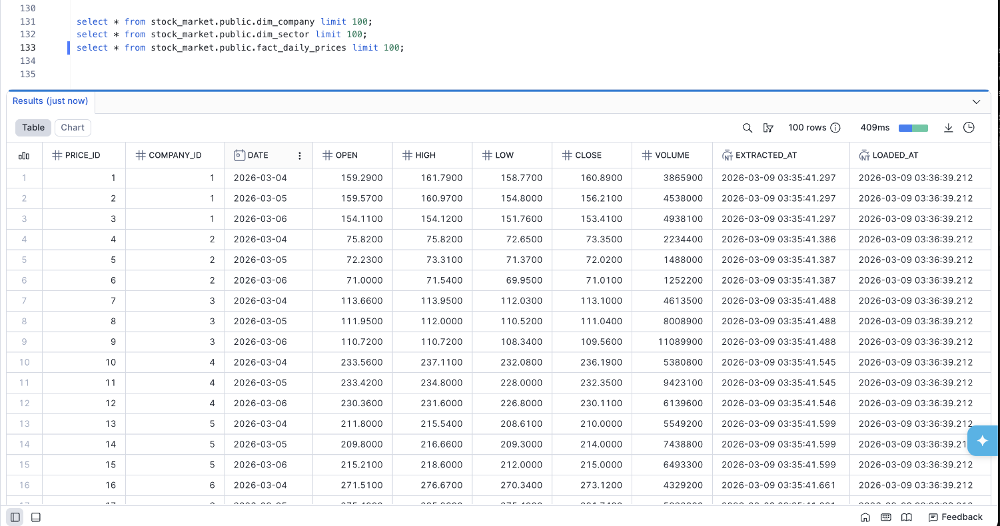

# Stock Market ETL Pipeline

An end-to-end ETL pipeline that extracts daily S&P 500 stock data from Yahoo Finance, transforms it into a star schema, stages it in AWS S3 as Parquet files, and auto-ingests into Snowflake via Snowpipe.

## Architecture

```
Wikipedia (S&P 500 list)
        |
        v
Yahoo Finance API ──> Airflow DAG ──> S3 (Parquet) ──> Snowpipe ──> Snowflake
                      [Extract]       [Load]           [Ingest]
                      [Transform]
```

### Pipeline Stages

| Stage | Task | Description |
|-------|------|-------------|
| Extract | `extract` | Scrapes S&P 500 tickers from Wikipedia, fetches OHLCV data from Yahoo Finance |
| Transform | `transform` | Builds dim/fact tables, runs 12 data quality validations |
| Load | `load_s3` | Converts DataFrames to Parquet, uploads to S3 staging |
| Ingest | `notify_snowpipe` | Triggers Snowpipe refresh for auto-ingestion into Snowflake |

## Results

### Airflow DAG
The pipeline runs as a 4-task DAG scheduled at 6 PM on weekdays.



### S3 Staging Bucket
Parquet files are partitioned by table and date in the S3 staging area.



### Snowflake Tables
Data lands in Snowflake's star schema tables within seconds via Snowpipe.



## Data Model

```
dim_sector (sector_id, sector, created_at)
    |
    v
dim_company (company_id, symbol, company_name, sector_id, ...)
    |
    v
fact_daily_prices (price_id, company_id, date, open, high, low, close, volume, ...)
```

## Tech Stack

- **Orchestration**: Apache Airflow 2.7
- **Data Source**: Yahoo Finance (via yfinance), Wikipedia
- **Storage**: AWS S3 (Parquet with Snappy compression)
- **Data Warehouse**: Snowflake (with Snowpipe auto-ingestion)
- **Containerization**: Docker & Docker Compose
- **Language**: Python 3.10

## Setup

For detailed step-by-step setup instructions (AWS S3, IAM, Snowflake storage integration, Snowpipe, S3 event notifications), see [SETUP.md](SETUP.md).

### Quick Start

1. **Configure environment variables**
   ```bash
   cp .env.example .env
   # Fill in your AWS and Snowflake credentials
   ```

2. **Run Snowflake DDL scripts**
   ```sql
   -- Execute in Snowflake worksheet
   -- 1. Create database, tables, and stage
   -- Run contents of sql/snowflake_setup.sql

   -- 2. Create Snowpipes
   -- Run contents of sql/snowpipe_setup.sql
   ```

3. **Start the pipeline**
   ```bash
   cd docker
   docker-compose up -d
   ```

4. **Access Airflow UI** at `http://localhost:8080`
   - Username: `admin`
   - Password: `admin`
   - Enable the `stock_market_etl` DAG and trigger a manual run

## Data Quality Validations

The pipeline runs 12 automated checks on every batch:

| # | Check | Description |
|---|-------|-------------|
| 1 | not_empty | Dataset is non-empty |
| 2 | no_null_symbols | No null stock symbols |
| 3 | no_null_dates | No null dates |
| 4 | positive_prices | OHLC prices > 0 |
| 5 | positive_volume | Volume >= 0 |
| 6 | ohlc_relationship | High >= Low, High >= Open/Close |
| 7 | date_format | Valid date format |
| 8 | no_duplicates | No symbol-date duplicates |
| 9 | symbol_format | Valid ticker format (A-Z, 0-9, -, .) |
| 10 | price_precision | Max 6 decimal places |
| 11 | reasonable_prices | Between $0.01 and $100,000 |
| 12 | volume_range | Volume <= 1 trillion |
